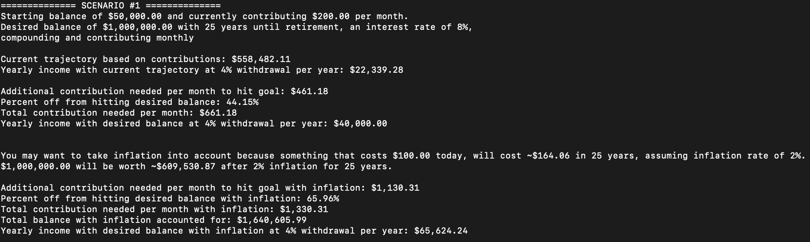
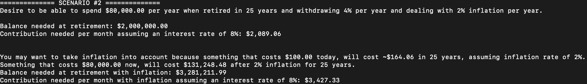

# Retirement Calculator

Welcome to the Retirement Calculator – your go-to tool for comprehensive retirement planning!

## Introduction

Are you ready to embark on the journey of securing your financial future? Planning for retirement can be both exciting and challenging. As someone with a deep passion for personal finance and a desire for a brighter financial future, I've created this tool to help you navigate the complexities of retirement planning.

## Installation

To use the Retirement Calculator in your project, install it via npm:

```bash
npm i retirement-calculator
```

## Why I Created This Package

My journey into retirement planning began with a simple realization: existing tools didn't provide me with the insights I needed. I wanted to know not only how much I should save for retirement but also how to get there. I realized that:

- I couldn't find a tool that told me exactly how much I should contribute each month to reach my desired retirement balance.
- Even if I reached my goal, I had no idea how much I could safely spend in retirement.
- Inflation would significantly impact my retirement needs, yet most calculators ignored this crucial factor.

To address these challenges, I started developing the Retirement Calculator package. It's a work in progress, and I have more exciting features in mind, but it's already a powerful tool for your retirement planning needs.

## Key Features

- **Contribution Calculation**: Determine monthly contributions needed to reach your desired retirement balance.
- **Withdrawal Estimation**: Understand how much you can safely spend from your retirement savings each year.
- **Inflation Adjustment**: Take into account the impact of inflation on your retirement savings and planning.


## Usage

### Importing the Calculator

```typescript
import { RetirementCalculator } from 'retirement-calculator';
```
### Calculating Compounding Interest With Additional Contributions
```typescript
const calculator = new RetirementCalculator();
const balance = calculator.getCompoundInterestWithAdditionalContributions(1000, 100, 1, .1, 12, 12);
```


### Calculate Contributions Needed to Achieve a Desired Balance
```typescript
const calculator = new RetirementCalculator();
const contributionsNeeded = getContributionNeededForDesiredBalance(1000,10000,10,.1,12,12);

// You won't necessarily hit your exact goal, so to find out what the exact total would be, run the following
const balance = calculator.getCompoundInterestWithAdditionalContributions(1000, contributionsNeeded.contributionNeededPerPeriod, 10, .1, 12, 12);
```

### Example Scenarios
I have made a couple example scenarios that can be found [here](examples).  This may give inspiration on how to best use this tool to plan for retirement.  There is a lot more to retirement than simply plugging numbers into a compounding interest calculator.

#### Scenario 1
Perhaps you have a starting balance in your retirement account, and want to get to the "prized" goal of $1,000,000.  Calculate how well you are doing now, and where you need to be in order to achieve your goal.  Also, potentially plan with inflation as this could severely impact your results.  To run, use ts-node in your console.

Running the script will output the following:



#### Scenario 2
Perhaps you don't know how much you want to have in retirement.  Instead, you would like to be able to spend $80,000 a year in retirement and not run out of money in 30 years based on the 4% rule.  You could also see what that would mean if you included inflation and wanted your $80,000 a year to go as far in 25 years as it does now.  To run, use ts-node in your console.

Running the script will output the following:



More scenarios will be added as I add planned capabilities in the future.

## Planned Enhancements
- **Detailed Periodic Reporting**: Provide a detailed breakdown of investments and interest accrued over each period, ideal for visualization.
- **Fee Management**: Include functionality to account for management fees and their long-term impact.
- **Dynamic Interest Rates**: Adapt to changing interest rates to reflect different stages of financial planning.
- **Loan and Withdrawal Impact**: Assess the effect of loans or withdrawals on your retirement savings.

## Upcoming Integration
- **Interactive UI**: Developing an intuitive interface for easy retirement planning.
- **Budgeting Tool Integration**: A future project to integrate with a budgeting tool for a comprehensive financial planning solution.

## Collaboration and Contributions
Your contributions and ideas are essential to making this tool even better. Whether you want to add new features, fix bugs, or introduce innovative concepts, your involvement is greatly appreciated. Let's connect and collaborate on GitHub.

## Docs
Docs were made with TypeDoc and can be found [here](https://introvertedspud.github.io/retirement-calculator/).

## License
This project is licensed under the [MIT License](LICENSE).

## Contact
For any inquiries or collaboration ideas, please feel free to reach out through [GitHub issues](https://github.com/introvertedspud/retirement-calculator/issues) on this repository. You can also connect with me on [LinkedIn](https://www.linkedin.com/in/shaunbonk/) for professional networking and discussions.

